Activity 2
================

``` r
library(tidyverse)
```

    ## ── Attaching packages ─────────────────────────────────────── tidyverse 1.3.2 ──
    ## ✔ ggplot2 3.3.6     ✔ purrr   0.3.4
    ## ✔ tibble  3.1.8     ✔ dplyr   1.0.9
    ## ✔ tidyr   1.2.0     ✔ stringr 1.4.1
    ## ✔ readr   2.1.2     ✔ forcats 0.5.2
    ## ── Conflicts ────────────────────────────────────────── tidyverse_conflicts() ──
    ## ✖ dplyr::filter() masks stats::filter()
    ## ✖ dplyr::lag()    masks stats::lag()

``` r
library(tidymodels)
```

    ## ── Attaching packages ────────────────────────────────────── tidymodels 1.0.0 ──
    ## ✔ broom        1.0.0     ✔ rsample      1.1.0
    ## ✔ dials        1.0.0     ✔ tune         1.0.0
    ## ✔ infer        1.0.4     ✔ workflows    1.0.0
    ## ✔ modeldata    1.0.0     ✔ workflowsets 1.0.0
    ## ✔ parsnip      1.0.1     ✔ yardstick    1.0.0
    ## ✔ recipes      1.0.1     
    ## ── Conflicts ───────────────────────────────────────── tidymodels_conflicts() ──
    ## ✖ scales::discard() masks purrr::discard()
    ## ✖ dplyr::filter()   masks stats::filter()
    ## ✖ recipes::fixed()  masks stringr::fixed()
    ## ✖ dplyr::lag()      masks stats::lag()
    ## ✖ yardstick::spec() masks readr::spec()
    ## ✖ recipes::step()   masks stats::step()
    ## • Learn how to get started at https://www.tidymodels.org/start/

``` r
music_50s <- read.csv("1950[1].csv")

music_60s <- read.csv("1960[1].csv")

music_70s <- read.csv("1970[1].csv")

music_80s <- read.csv("1980[1].csv")

music_90s <- read.csv("1990[1].csv")

music_00s <- read.csv("2000[1].csv")

music_10s <- read.csv("2010[1].csv")
```

``` r
music <- rbind(music_50s, music_60s, music_70s, music_80s, music_90s, music_00s, music_10s)
```

``` r
ggplot(music, aes(x = bpm))+
        geom_histogram()
```

    ## `stat_bin()` using `bins = 30`. Pick better value with `binwidth`.

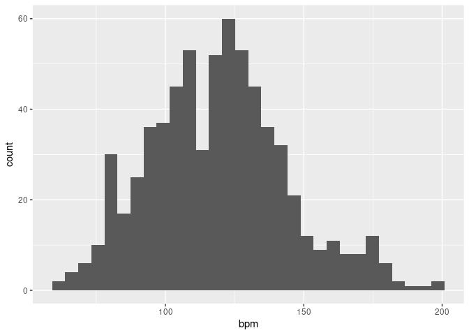<!-- -->

``` r
ggplot(music, aes(x = nrgy))+
        geom_histogram()
```

    ## `stat_bin()` using `bins = 30`. Pick better value with `binwidth`.

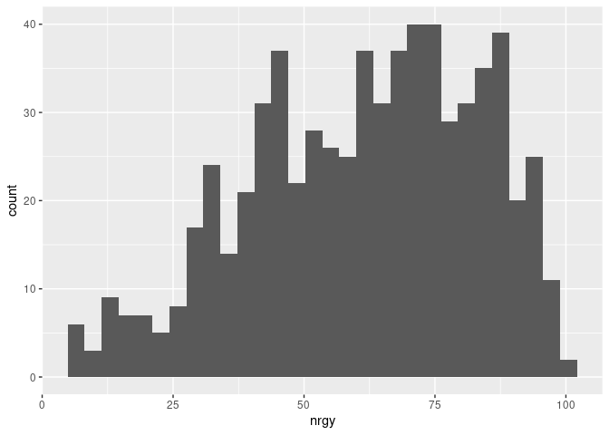<!-- -->

``` r
ggplot(music, aes(x = dnce))+
        geom_histogram()
```

    ## `stat_bin()` using `bins = 30`. Pick better value with `binwidth`.

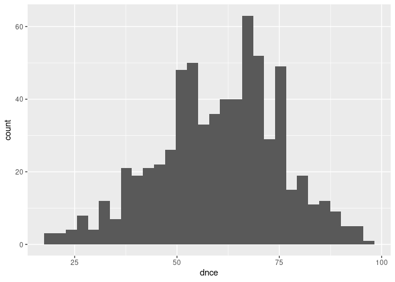<!-- -->

``` r
ggplot(music, aes(x = dB))+
        geom_histogram()
```

    ## `stat_bin()` using `bins = 30`. Pick better value with `binwidth`.

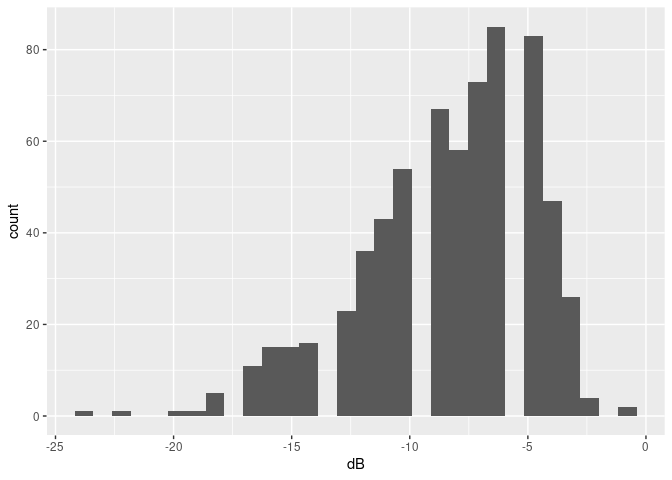<!-- -->

``` r
ggplot(music, aes(x = live))+
        geom_histogram()
```

    ## `stat_bin()` using `bins = 30`. Pick better value with `binwidth`.

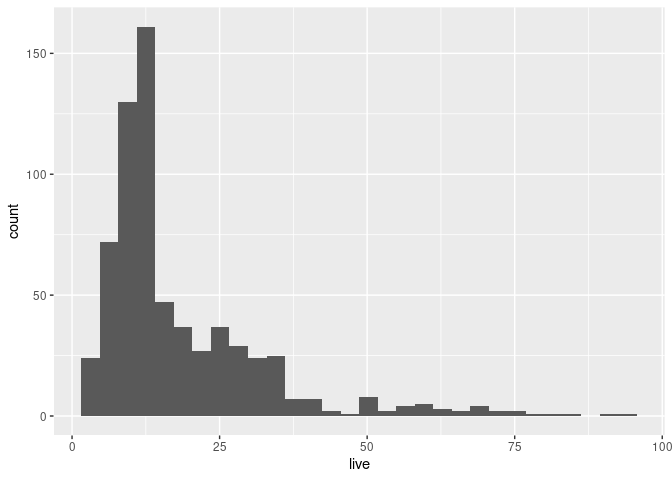<!-- -->

``` r
ggplot(music, aes(x = val))+
        geom_histogram()
```

    ## `stat_bin()` using `bins = 30`. Pick better value with `binwidth`.

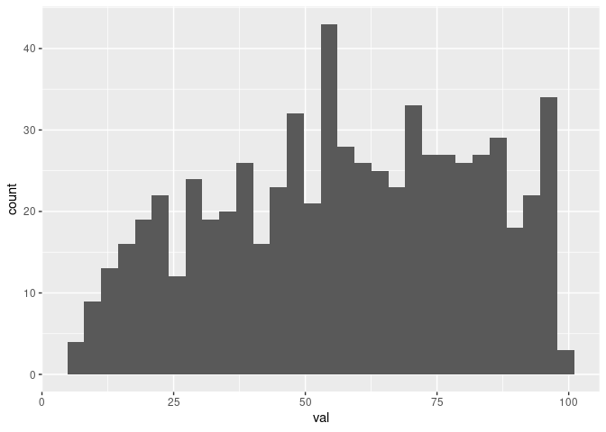<!-- -->

``` r
ggplot(music, aes(x = dur))+
        geom_histogram()
```

    ## `stat_bin()` using `bins = 30`. Pick better value with `binwidth`.

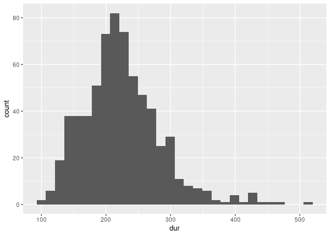<!-- -->

``` r
ggplot(music, aes(x = acous))+
        geom_histogram()
```

    ## `stat_bin()` using `bins = 30`. Pick better value with `binwidth`.

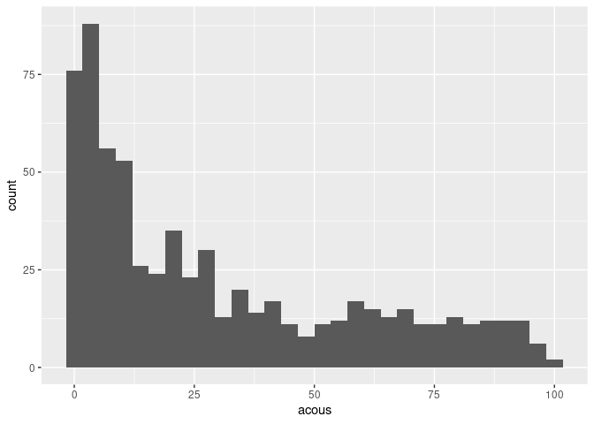<!-- -->

``` r
ggplot(music, aes(x = spch))+
        geom_histogram()
```

    ## `stat_bin()` using `bins = 30`. Pick better value with `binwidth`.

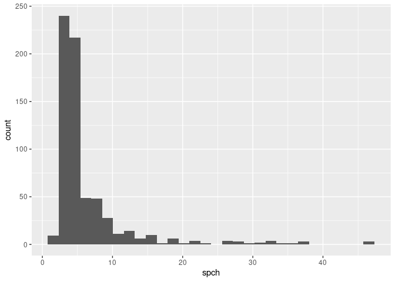<!-- -->

``` r
ggplot(music, aes(x = bpm, y = pop))+ 
  geom_point()
```

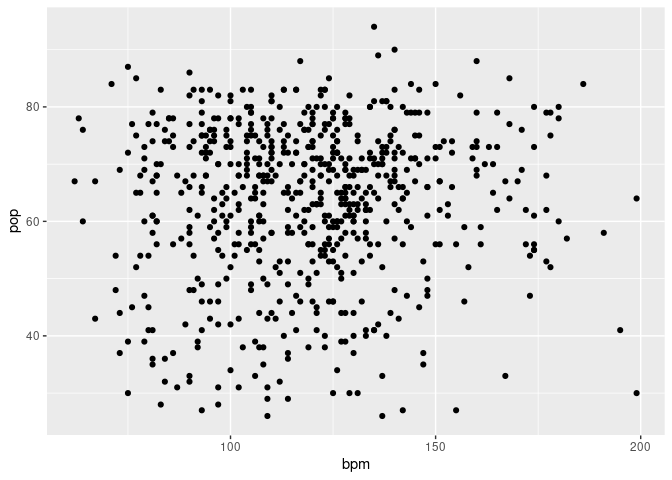<!-- -->

``` r
cor(music$bpm, music$pop)
```

    ## [1] 0.06655842

``` r
ggplot(music, aes(x = nrgy, y = pop))+ 
  geom_point()
```

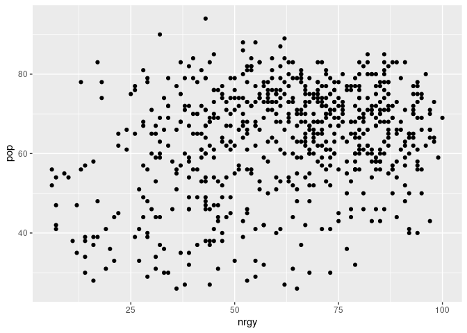<!-- -->

``` r
cor(music$nrgy, music$pop)
```

    ## [1] 0.2717984

``` r
ggplot(music, aes(x = dnce, y = pop))+ 
  geom_point()
```

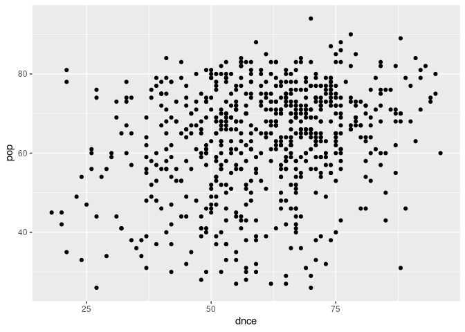<!-- -->

``` r
cor(music$dnce, music$pop)
```

    ## [1] 0.2493024

``` r
ggplot(music, aes(x = dB, y = pop))+ 
  geom_point()
```

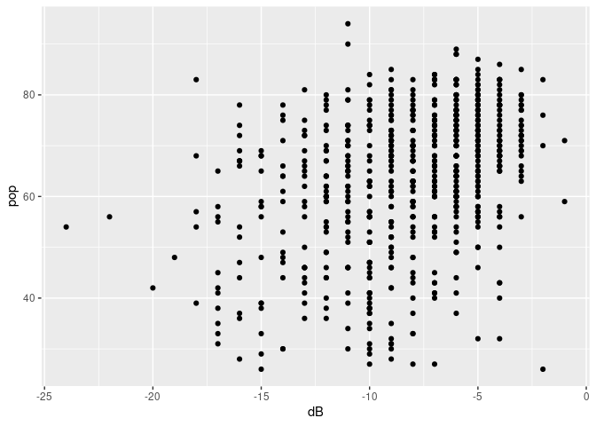<!-- -->

``` r
cor(music$dB, music$pop)
```

    ## [1] 0.3651723

``` r
ggplot(music, aes(x = live, y = pop))+ 
  geom_point()
```

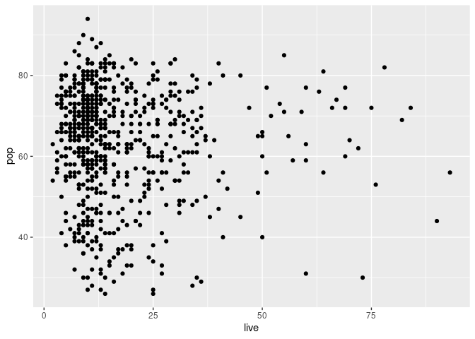<!-- -->

``` r
cor(music$live, music$pop)
```

    ## [1] -0.03650496

``` r
ggplot(music, aes(x = val, y = pop))+ 
  geom_point()
```

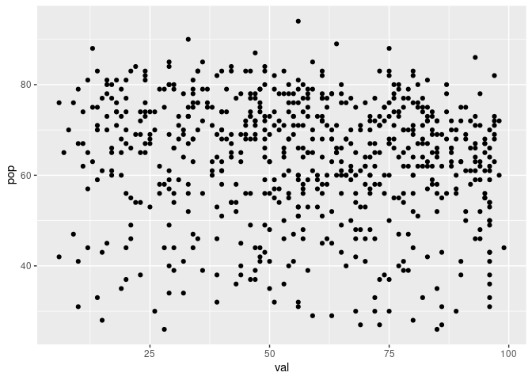<!-- -->

``` r
cor(music$val, music$pop)
```

    ## [1] -0.1024175

``` r
ggplot(music, aes(x = dur, y = pop))+ 
  geom_point()
```

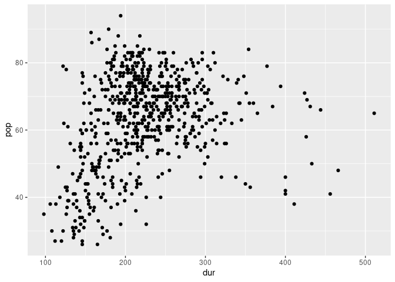<!-- -->

``` r
cor(music$dur, music$pop)
```

    ## [1] 0.2805007

``` r
ggplot(music, aes(x = acous, y = pop))+ 
  geom_point()
```

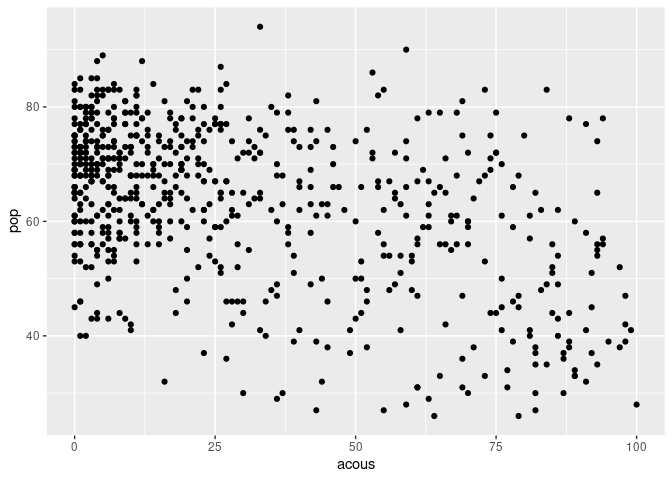<!-- -->

``` r
cor(music$acous, music$pop)
```

    ## [1] -0.4552388

``` r
ggplot(music, aes(x = spch, y = pop))+ 
  geom_point()
```

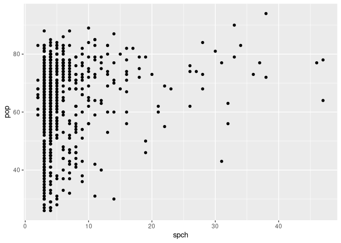<!-- -->

``` r
cor(music$spch, music$pop)
```

    ## [1] 0.1929292

``` r
lm_spec <- linear_reg() %>% 
  set_mode("regression") %>% 
  set_engine("lm")
```

``` r
slr_mod <- lm_spec %>% 
  fit(data = music, pop ~ dB)

tidy(slr_mod)
```

    ## # A tibble: 2 × 5
    ##   term        estimate std.error statistic   p.value
    ##   <chr>          <dbl>     <dbl>     <dbl>     <dbl>
    ## 1 (Intercept)    74.8      1.24       60.6 8.15e-273
    ## 2 dB              1.37     0.135      10.1 1.81e- 22


1.  The intercept is 74.8. This means a song with dB = 0 would have a
    popularity of 74.8.

2.  The slope is
